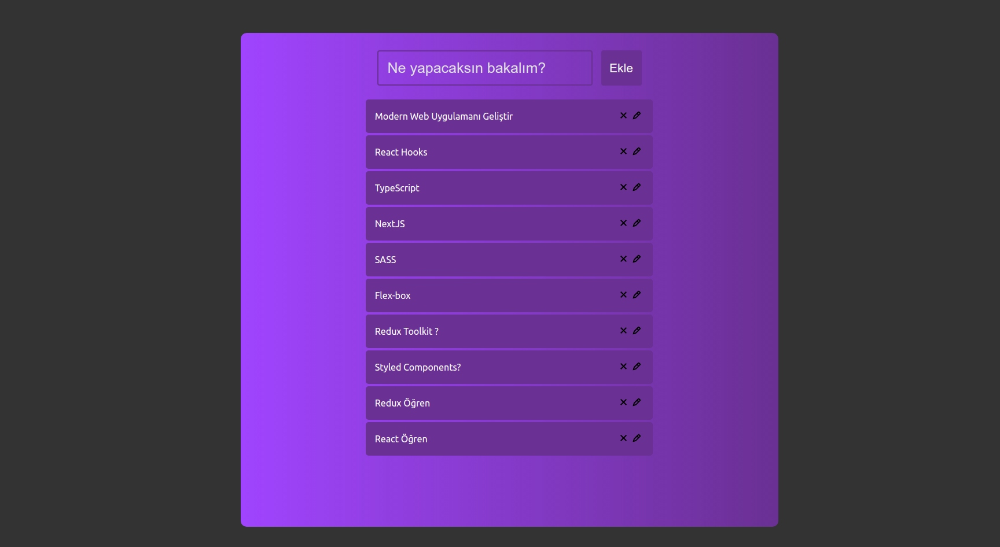

## Getting Started

```bash
git clone https://github.com/didemkaraaslan/todoapp_youtube.git
cd todoapp_youtube/
npm i
npm start
# or
yarn run
```

Open [http://localhost:3000](http://localhost:3000) with your browser to see the result.

# ScreenShot

## Home Screen


